# Reversing VM Protect 3 #

**A tutorial walking through the process of devirtualising programmes protected
by VMProtect 3**

### About VMProtect ###

* VM Based Protector/Obfuscator

* [`RISC`](https://cs.stanford.edu/people/eroberts/courses/soco/projects/risc/risccisc/) archetecture

* Fairly simple to beat compared to more extreme VM Protectors (eg. `Obsedium`)

## Create demo programme ##

Here is the the source code for the programme we are going to virtualize.

Although this is a very basic programme, the difficuly of devirutalizing a simple vs complicated programme 
is the same. Once the underlying structure of the VM is understood, the complexity of the 
underlying code is irrelevant to the devirtualising process. 

    
    // Compiled with mingw "gcc.exe -masm=intel -o VMP.exe "./VMP.c" 
    
    
    void virtualized(){
    
        int V;
        char abc[10];
        
        scanf("%10s", abc);
        
        __asm__ (
            "mov ebx, 0x11111111;"
            "mov ebx, 0x22222222;"
            "mov ebx, 0x33333333;"
            "mov ebx, 0x44444444;"
            "mov ebx, 0x55555555;"
            "mov ebx, 0x66666666;"
            "mov ebx, 0x77777777;"
            "mov ebx, 0x88888888;"
            "mov ebx, 0x99999999;"
            "mov ebx, 0xaaaaaaaa;"
            "mov ebx, 0xbbbbbbbb;"
            "mov ebx, 0xcccccccc;"
            "mov ebx, 0xdddddddd;"
            "mov ebx, 0xeeeeeeee;"
            "mov ebx, 0xffffffff;"
        
            "add ebx, 0x1;"
            "add ebx, 0x1;"
            "add ebx, 0x1;"
            "add ebx, 0x1;"
            "add ebx, 0x1;"
            "add ebx, 0x1;"
            "add ebx, 0x1;"
            "sub ebx, 0x1;"
            "sub ebx, 0x1;"
            "sub ebx, 0x1;"
            "sub ebx, 0x1;"
            "sub ebx, 0x1;"
            "sub ebx, 0x1;"
            "sub ebx, 0x1;"
            
            "mov eax, ebx;"
        
            : "=r" (V)
    
        );
        
        printf("Val: %x\n", V);
        
    }
    
    void main(){
    
        __asm__(".intel_syntax;");
    
        int x;
        char abc[10];
        printf("GO!\n");
    
        for (x=0;x<1000; x++){
            virtualized();
        }
    
    }

## Virutalize the programme ##

After compiling the initial source code with `mingw` open it up in VMProtect:

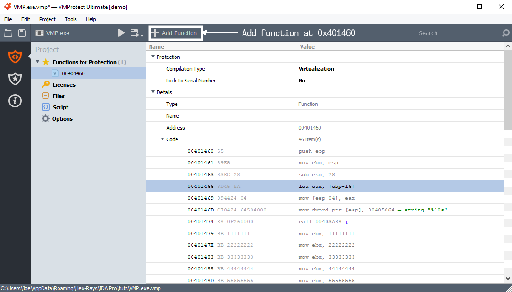

Add the function we want to virtualize (located at `0x401460`)

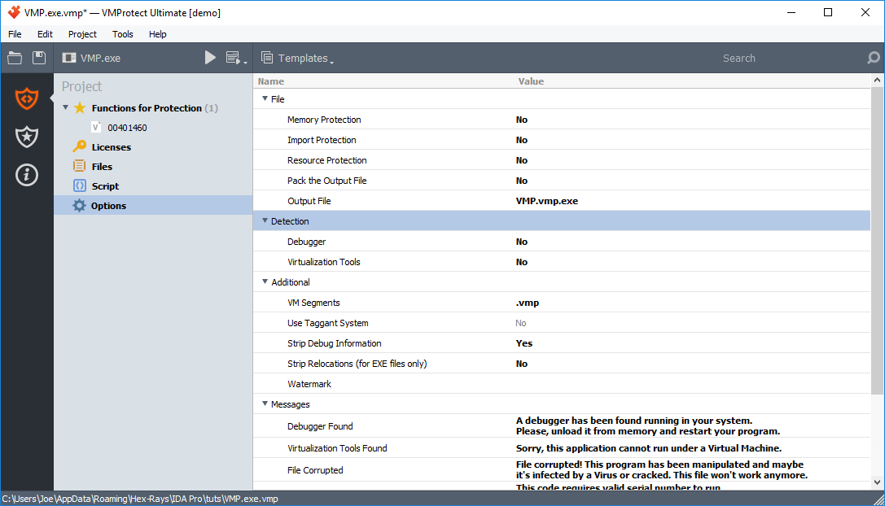

All additional protections besides the core VM are disabled for now

After setting up the configuration as above, compile it using `tools->compile`

## Run in IDA ##

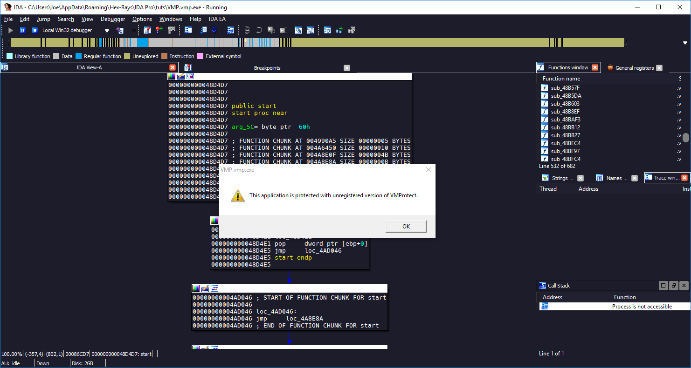

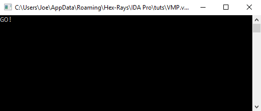

Open the virtualised programme `VMP.vmp.exe` in IDA and run past the demo warning.

We want to find the locations where new VM instructions are loaded from 
memory. The VM's `IP` is stored in the `ESI` register, therefore, we can spot
new instructions being loaded each time `ESI` is dereferenced. It is randomized 
at compile time whether the VM's `IP` counts upwards or downwards so be wary of this.

In order to find these locations without stepping though every instruction individually,
run the following IDAPython script  to set a breakpoint at the beginning of every procedure in the programme.

    
    
    from idaapi import *
    from idautils import *
    
    def add_bp(addr, flags=9, type=4, size=0):
        add_bpt(addr,size,type)
        bp = bpt_t()
        
        # set flags in case breakpoint alread existed
        get_bpt(addr,bp)
        bp.flags = flags
        bp.type = type
        bp.size = size
        update_bpt(bp)
        return bp
        
    def breakFunc(flags=9):
    
        for func in Functions(0, 0xffffffff):
            name = GetFunctionName(func)
            print name
            add_bp(func, flags)
        
    breakFunc()

## Locating the VM's bytecode ##

Enter some chars to start the loop

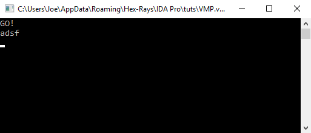

Continue forward a few times until you are definately in the VM's 
instruction loop.

Since `ESI `is the VM's `IP`, it points to the bytecode read by the VM. 
We can read the VM's bytecode by going to this location.
Upon examination and reformatting, the bytecode language is fairly straightforward:

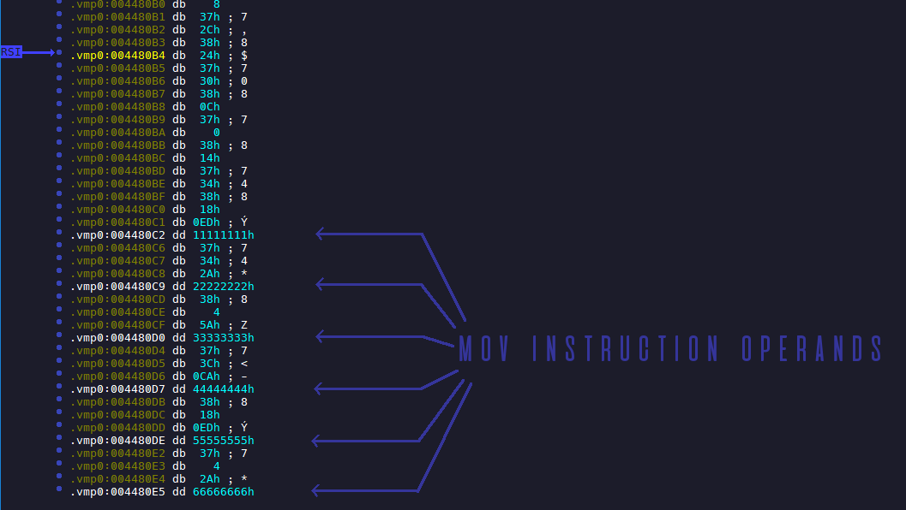

#### Note on the VM's archetecture ####

The VM has a total of 3 registers. Consequently, the would-be values of the
registers in the programme are stored as local variables on the stack (the VM's 
internal registers are also stored on the stack but are distinct from these variables.).

Since the VM mimics `RISC` architecture, the opperands for an instruction must
both be loaded from memory into registers before an operation can take place. For example,
the general format for an `add` instruction would be as follows:
    
    Instead of :
    
        mov ebx, 0x1000
        add dword [ebx], 0x1
    
    We have:
                
        # Load into Registers
        ldr r0, [0x1000]
        mov  r1, 0x1
        
        # Perform the operation        
        add r0, r1
        
        # Store the result
        str r0, [0x1000]
    
    
    
As an added layer of obsufucation. The local variable which is used to store
the result of an operation may not be the same as the one which it was loaded from. In other words,
 the result could be stored in a variable located the offset `[0x1200]` despite being loaded from
 `[0x1000]`. The logic of what each variable corresponds to in the programme is handled by the bytecode of the VM.  
     
Now we understand something about the basic structure of the VM we can observe it in practise.

## Identifying the Main Jumptable ##

Step though the code until you encounter the VM's main jumptable.

The jumptable works as follows. A byte is read from the VM's bytecode by dereferencing `ESI`, The value of this byte is used in 
used in conjunction with the jump table to resolve to location of the procedure relating to the instruction to be executed.

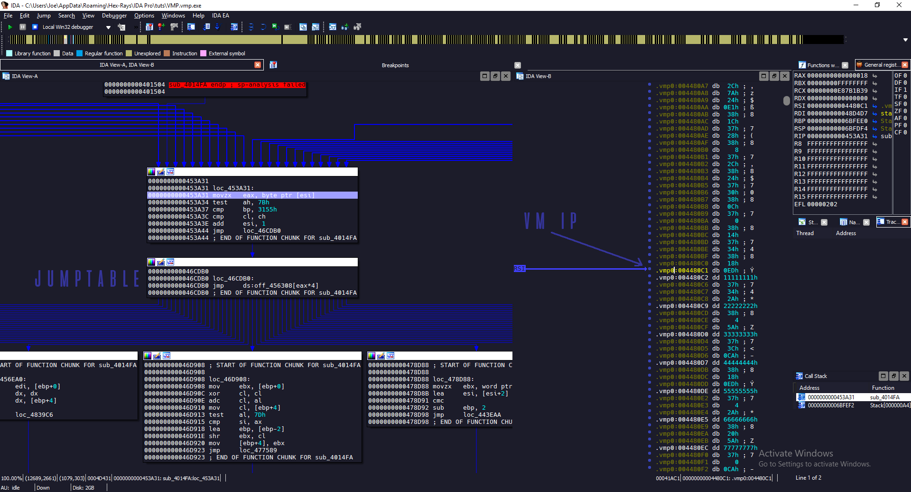

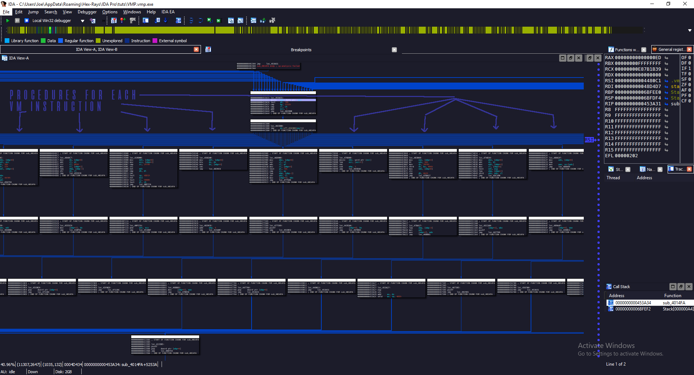

Note that there are multiple procedures that can be called for each potential
operation. This provides an extra layer of obscufication as they all need to be resolved
in order to fully devirtualize the code.

## Understanding the VM's instructions ##

After hitting the jumptable, you will end up at a procedure corresponding to an instruction in the VM's bytecode
. This procedure executes a single VM instruction 
 (in this case `mov r0, const`) and then
 returns to the jumptable after incrementing the VM's `IP`.
 

Here is an example:

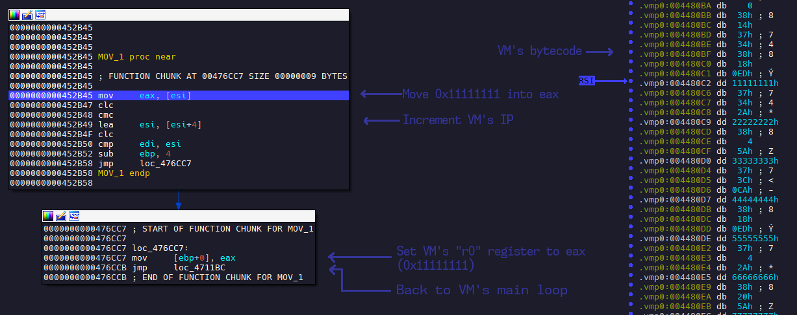

As we can see, bytecode instruction `0x3d` followed by an immediate constant
moves the immediate constant to the location of the VM's `r0` register (`[ebp]`) resulting in the operation: `mov r0, const`.

After `mov` we go back to the jumptable and then jump to the next bytecode instruction, in this case a `store` instruction (`0x37`):
    
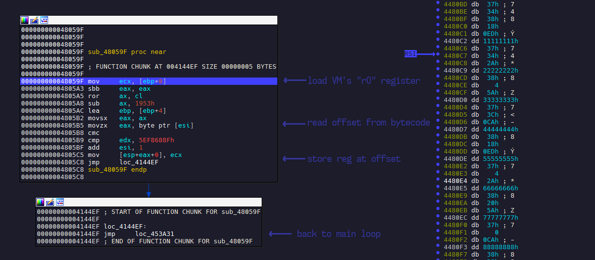

By now you should see the basic pattern of the VM. The instruction `store` (also called `str`) followed by an offset (in this case `0x34`),
 takes `r0` and stores it at the location corresponding to the offset.

The bytecode instructions `0x2a`, `0x5A` and `0xca` are functionally identical to `0x3d` `(mov r0, const)` and
instruction `0x38` if is identical to `0x37` `(str offset, r0)`.

With this in mind, the first 10 or so instructions of the VM's byte code roughly translates to:

    mov r0, 0x11111111
    str var_34, r0
    mov r0, 0x2222222
    str var_38, r0
    mov r0, 0x3333333
    str var_4, r0
    mov r0, 0x4444444
    str var_3, r0    
    mov r0, 0x55555555
    str var_4, r0
    ect...
    
    
As previously mentioned, the offsets used to store the results of operations
 are randomised to add an extra layer of obfuscation.

Now we will move onto restoring the `add` instructions from our original binary.

Since the VM is `RISC` based, the execution of an
 `add` instruction now requires multiple steps. 
First the constant `0x1` is moved into the`r0` register
using the already deduced `mov` instruction (`0xca`). Then the local variable
`var_4` (containing `0xfffffff`) is loaded into `r1`
using another `mov` instruction (`0x99`). 

Then we have the `add` instruction itself (`0x7c`):

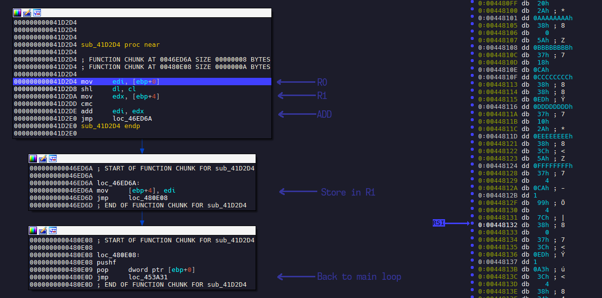

This simply takes `r0` and `r1` adds them together and 
stores the result in `r1`. 

Following the `add` instruction, `r1` is then committed to memory at `var_0` and `var_36` using the previously mentioned `str` instructions.

This process is repeated for each of the `add` instructions in the original programme giving the following roughly equivalent byte code:

    mov r0, var_4
    mov r1, 0x1
    add r0, r1
    str var_0, r0
    str var_3c, r0
    
    mov r0, var_3c
    mov r1, 0x1
    add r0, r1
    str var_0, r0
    str var_3c, r0
    
    ect...

At this point we have reversed 3 of bytecode operations used by the VM (`mov`, `add` and `str`).
The rest are discovered in much the same way (there are around a dozen total). 
Once we have deduced the meaning of all the bytecode operations used by the VM
we can write a script to disassemble the bytecode.

## Write a script to dissasemble the bytecode ##
The following script only includes `add`, `nand`, `nor`, `mov` and `str`, since these are the only
 instructions used by the visualized sequence we are reversing, but for larger programmes, simply add instructions as nessecary.
 

 
Since, VM Protect randomises the values of each bytecode instruction with each compile, you will have to
deduce the hardcoded values on a case by case basis, but since the overarching structure of the 
VM is the same every time, this should be fairly straightforward.

Here is a script to devirtualise the Bytecode of in our function using the information gathered.

    
    from idaapi import *
    
    
    def encode_val(val):
       return "".join(reversed(val)).encode("HEX")
    
    bytecode_start = 0x4480C1
    mov_r2_const = (0xed, 0x2a, 0x5a, 0xca)
    mov_r1_offset = (0x99, 0x16, 0xa3)
    mov_r0_offset = (0xc2, 0x76, 0x7a)
    
    mov_r0_dword_r0 = (0xbf, 0xc6, 0xfa, 0x1C)
    mov_r0_ebp = (0x8a,0x98, 0x68, 0x75, 0, 0x5b)
    mov_dword_r0_r1 = (0x89,)
    mov_var_r1 = (0x38, 0x05, 0x3c, 0x34, 0x18)
    
    
    mov_var_r2 = (0x37,)
    add_r1_r2 = (0x7c, 0x04)
    nand_r1_r0 = (0xa9, 0x25, 0x5f)
    nor_r2_r1 = (0x39, 0x0D)
    
    
    byte_code = dbg_read_memory(bytecode_start, 800)
    current = 0
    
    while True:
    
        instruction = ord(byte_code[current])
    
        current += 1
        addr = hex(current + bytecode_start) + ": "
    
        if instruction in mov_r2_const:
            print addr + "mov r2, 0x" + encode_val(byte_code[current:current+4])
            current += 4
    
        elif instruction in mov_r1_offset:
            print addr + "mov r1, " + "[var_" + encode_val(byte_code[current]) + "]"
            current += 1
    
        elif instruction in mov_r0_offset:
            print addr + "mov r0, " + "[var_" + encode_val(byte_code[current]) + "]"
            current += 1
    
        elif instruction in mov_dword_r0_r1:
            print addr + "mov dword[r0], r1"
    
        elif instruction in mov_r0_dword_r0:
            print addr + "mov r0, dword[r0]"
    
        elif instruction in mov_r0_ebp:
            print addr + "mov r0, &r1"
    
        elif instruction in mov_var_r1:
            print addr + "mov [var_" + encode_val(byte_code[current]) + "], r1"
            current += 1
    
        elif instruction in mov_var_r2:
            print addr + "mov [var_" + encode_val(byte_code[current]) + "], r2"
            current += 1
    
        elif instruction in add_r1_r2:
            print addr + "add r1, r2"
    
        elif instruction in nand_r1_r0:
            print addr + "nand r1, r0"
    
        elif instruction in nor_r2_r1:
            print addr + "nor r1, r0"
    
        else:
            print "could not dissaseble instrction at: " + addr + hex(instruction)
            break
    
        if current > len(byte_code):
            break

Upon running the script we get the following output:

    0x4480c2: mov r2, 0x11111111
    0x4480c7: mov [var_34], r2
    0x4480c9: mov r2, 0x22222222
    0x4480ce: mov [var_04], r1
    0x4480d0: mov r2, 0x33333333
    0x4480d5: mov [var_3c], r2
    0x4480d7: mov r2, 0x44444444
    0x4480dc: mov [var_18], r1
    0x4480de: mov r2, 0x55555555
    0x4480e3: mov [var_04], r2
    0x4480e5: mov r2, 0x66666666
    0x4480ea: mov [var_20], r1
    0x4480ec: mov r2, 0x77777777
    0x4480f1: mov [var_00], r2
    0x4480f3: mov r2, 0x88888888
    0x4480f8: mov [var_38], r1
    0x4480fa: mov r2, 0x99999999
    0x4480ff: mov [var_20], r2
    0x448101: mov r2, 0xaaaaaaaa
    0x448106: mov [var_00], r1
    0x448108: mov r2, 0xbbbbbbbb
    0x44810d: mov [var_18], r2
    0x44810f: mov r2, 0xcccccccc
    0x448114: mov [var_38], r1
    0x448116: mov r2, 0xdddddddd
    0x44811b: mov [var_10], r2
    0x44811d: mov r2, 0xeeeeeeee
    0x448122: mov [var_3c], r1
    0x448124: mov r2, 0xffffffff
    0x448129: mov [var_04], r2
    0x44812b: mov r2, 0x00000001
    0x448130: mov r1, [var_04]
    0x448132: add r1, r2
    0x448133: mov [var_00], r1
    0x448135: mov [var_3c], r2
    0x448137: mov r2, 0x00000001
    0x44813c: mov r1, [var_3c]
    0x44813e: add r1, r2
    0x44813f: mov [var_34], r1
    0x448141: mov [var_38], r2
    0x448143: mov r2, 0x00000001
    0x448148: mov r0, [var_38]
    0x44814a: add r1, r2
    0x44814b: mov [var_18], r1
    0x44814d: mov [var_00], r2
    0x44814f: mov r2, 0x00000001
    0x448154: mov r1, [var_00]
    0x448156: add r1, r2
    0x448157: mov [var_18], r1
    0x448159: mov [var_04], r2
    0x44815b: mov r2, 0x00000001
    0x448160: mov r0, [var_04]
    0x448162: add r1, r2
    0x448163: mov [var_38], r1
    0x448165: mov [var_38], r2
    0x448167: mov r2, 0x00000001
    0x44816c: mov r0, [var_38]
    0x44816e: add r1, r2
    0x44816f: mov [var_10], r1
    0x448171: mov [var_18], r2
    0x448173: mov r2, 0x00000001
    0x448178: mov r1, [var_18]
    0x44817a: add r1, r2
    0x44817b: mov [var_38], r1
    0x44817d: mov [var_34], r2
    0x44817f: mov r2, 0x00000001
    0x448184: mov r1, [var_34]
    0x448186: mov r0, [var_34]
    0x448188: nand r1, r0
    0x448189: mov [var_04], r1
    0x44818b: add r1, r2
    0x44818c: mov [var_18], r2
    0x44818e: mov r0, &r1
    0x44818f: mov r0, dword[r0]
    0x448190: nand r1, r0
    0x448191: mov [var_18], r1
    0x448193: mov [var_10], r2
    0x448195: mov r2, 0x00000001
    0x44819a: mov r1, [var_10]
    0x44819c: mov r0, [var_10]
    0x44819e: nand r1, r0
    0x44819f: mov [var_00], r1
    0x4481a1: add r1, r2
    0x4481a2: mov [var_18], r2
    0x4481a4: mov r0, &r1
    0x4481a5: mov r0, dword[r0]
    0x4481a6: nor r1, r0
    0x4481a7: mov [var_38], r1
    0x4481a9: mov [var_38], r2
    0x4481ab: mov r2, 0x00000001
    0x4481b0: mov r0, [var_38]
    0x4481b2: mov r1, [var_38]
    0x4481b4: nand r1, r0
    0x4481b5: mov [var_04], r1
    0x4481b7: add r1, r2
    0x4481b8: mov [var_10], r2
    0x4481ba: mov r0, &r1
    0x4481bb: mov r0, dword[r0]
    0x4481bc: nand r1, r0
    0x4481bd: mov [var_04], r1
    0x4481bf: mov [var_3c], r2
    0x4481c1: mov r2, 0x00000001
    0x4481c6: mov r1, [var_3c]
    0x4481c8: mov r0, [var_3c]
    0x4481ca: nor r1, r0
    0x4481cb: mov [var_04], r1
    0x4481cd: add r1, r2
    0x4481ce: mov [var_38], r2
    0x4481d0: mov r0, &r1
    0x4481d1: mov r0, dword[r0]
    0x4481d2: nand r1, r0
    0x4481d3: mov [var_00], r1
    0x4481d5: mov [var_00], r2
    0x4481d7: mov r2, 0x00000001
    0x4481dc: mov r1, [var_00]
    0x4481de: mov r0, [var_00]
    0x4481e0: nor r1, r0
    0x4481e1: mov [var_18], r1
    0x4481e3: add r1, r2
    0x4481e4: mov [var_10], r2
    0x4481e6: mov r0, &r1
    0x4481e7: mov r0, dword[r0]
    0x4481e8: nand r1, r0
    0x4481e9: mov [var_38], r1
    0x4481eb: mov [var_10], r2
    0x4481ed: mov r2, 0x00000001
    0x4481f2: mov r0, [var_10]
    0x4481f4: mov r1, [var_10]
    0x4481f6: nand r1, r0
    0x4481f7: mov [var_3c], r1
    0x4481f9: add r1, r2
    0x4481fa: mov [var_04], r2
    0x4481fc: mov r0, &r1
    0x4481fd: mov r0, dword[r0]
    0x4481fe: nand r1, r0
    0x4481ff: mov [var_00], r1
    0x448201: mov [var_20], r2
    0x448203: mov r2, 0x00000001
    0x448208: mov r1, [var_20]
    0x44820a: mov r0, [var_20]
    0x44820c: nor r1, r0
    0x44820d: mov [var_18], r1
    0x44820f: add r1, r2
    0x448210: mov [var_38], r2
    0x448212: mov r0, &r1
    0x448213: mov r0, dword[r0]
    0x448214: nor r1, r0
    0x448215: mov [var_10], r1
    0x448217: mov [var_04], r2
    0x448219: mov r1, [var_38]
    0x44821b: mov r2, 0x00000815
    0x448220: nor r1, r0
    0x448221: mov [var_2c], r1
    0x448223: mov r0, &r1
    0x448224: mov r0, dword[r0]
    0x448225: nand r1, r0
    0x448226: mov [var_20], r2
    0x448228: mov r0, [var_10]
    0x44822a: mov r2, 0xfffff7ea
    0x44822f: nor r1, r0
    0x448230: mov [var_00], r1
    0x448232: mov r0, &r1
    0x448233: mov r0, dword[r0]
    0x448234: nor r1, r0
    0x448235: mov [var_18], r2
    0x448237: add r1, r2
    0x448238: mov [var_2c], r1
    0x44823a: mov [var_18], r2
    0x44823c: mov r0, [var_04]
    0x44823e: mov [var_38], r1
    0x448240: mov r1, [var_38]
    0x448242: mov r1, [var_0c]
    0x448244: mov r2, 0xfffffff4
    0x448249: add r1, r2
    0x44824a: mov [var_28], r2
    0x44824c: mov dword[r0], r1
    0x44824d: mov r0, [var_0c]
    0x44824f: mov r2, 0xfffffff4
    0x448254: add r1, r2
    0x448255: mov [var_2c], r1
    0x448257: mov r0, dword[r0]
    0x448258: mov [var_3c], r2
    0x44825a: mov r1, [var_3c]
    0x44825c: mov r0, &r1
    0x44825d: mov r2, 0x00000004
    0x448262: add r1, r2
    0x448263: mov [var_20], r1
    0x448265: mov r2, 0x00000004
    0x44826a: add r1, r2
    0x44826b: mov [var_20], r2
 
Note that the VM translated each of our `sub` instructions into the equivalent instruction sequence:
 
    0x44817f: mov r2, 0x00000001
    0x448184: mov r1, [var_34]
    0x448186: mov r0, [var_34]
    0x448188: nand r1, r0
    0x448189: mov [var_04], r1
    0x44818b: add r1, r2
    0x44818c: mov [var_18], r2
    0x44818e: mov r0, &r1
    0x44818f: mov r0, dword[r0]
    0x448190: nand r1, r0
    0x448191: mov [var_18], r1
    0x448193: mov [var_10], r2

`var_34` is loaded into both `r0` and `r1` and a `nand` operation is performed resulting in `~var_34 & ~var_34` 
(which is equalivalent to simply `~var_34`). Then the amount to be subtracted (in this case `1` ) is added. Then,
instrctions `0x44818e` and `0x44818f` set `r0` equal to `r1` (the dissasembler could simplify this sequence to simply
`mov r0, r1`). Finally, a `nand` is performed again resulting in the overall sequence: `~(~var_34 + 1)`. Since,
`~(~x + y) = x - y`, this is equivalent to a `sub` instruction.

## Conclusion ##

This tutorial has shown how to approach reversing files protected by VMProtect 3
to restore equivalent machine code. With some extra work, you could probably get back the original `CISC` code.
Nevertheless, you have seen how to reverse engineer VM based file protections. 

    

